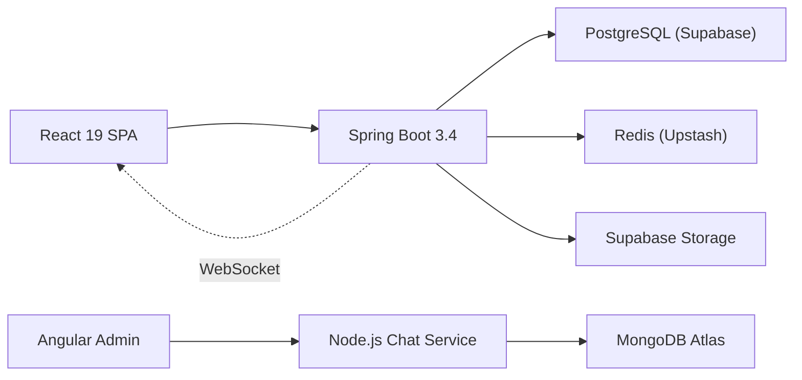

<div align="center">

  <h1>FriendsHub</h1>
  <p><strong>A full-stack social media platform with real-time chat, end-to-end encryption, and ephemeral stories.</strong></p>

  <p>
    <a href="https://www.friendshub.me">🌐 Live Demo</a>
    &nbsp;·&nbsp;
    <a href="docs/API_REFERENCE.md">API Docs</a>
    &nbsp;·&nbsp;
    <a href="docs/DEPLOYMENT_GUIDE.md">Deploy Guide</a>
    &nbsp;·&nbsp;
    <a href="CONTRIBUTING.md">Contribute</a>
  </p>

  <p>
    
    
    
    
    
  </p>

</div>

---

## About

FriendsHub is a production-grade social networking platform where users can share posts, upload ephemeral stories, chat in real-time with end-to-end encryption, and explore their social graph — all wrapped in a responsive, modern UI.

**Key highlights:**

- **E2EE Messaging** — Direct and group chat encrypted client-side with ECDH + AES-256-GCM via Web Crypto API
- **Real-time** — STOMP over WebSocket for instant messaging, typing indicators, read receipts, and online presence
- **Ephemeral Stories** — 24-hour auto-expiring media stories with viewer analytics
- **Smart Social Graph** — Friend recommendations, compatibility scores, milestones, and network visualization
- **Hardened Security** — JWT + refresh tokens, OWASP XSS sanitization, Redis token blacklisting, rate limiting, and Row-Level Security on all tables

---

## Architecture



| Layer | Stack |
|:---|:---|
| Frontend | React 19, Vite, Tailwind CSS 4, Framer Motion |
| Backend | Java 17, Spring Boot 3.4, Spring Security, Spring Data JPA, WebSocket |
| Databases | PostgreSQL (Supabase) with Flyway · Redis (Upstash) · MongoDB Atlas |
| Infrastructure | Docker, GitHub Actions CI, Render (backend), Vercel (frontend) |

---

## Getting Started

```bash
# Clone
git clone https://github.com/Jayanand07/Friends-Hub.git && cd Friends-Hub

# Configure
cp .env.example .env            # fill in DB, JWT, Supabase, mail credentials
cp frontend/.env.example frontend/.env   # fill in API URL and Supabase keys

# Start Redis
docker compose up -d

# Backend (Terminal 1)
mvn spring-boot:run              # → http://localhost:8080/api

# Frontend (Terminal 2)
cd frontend && npm install && npm run dev   # → http://localhost:5173
```

> See [Deployment Guide](docs/DEPLOYMENT_GUIDE.md) for production setup on Render + Vercel.

---

## Documentation

Detailed guides live in the [`docs/`](docs/) directory:

| Guide | What's inside |
|:---|:---|
| [Project Overview](docs/PROJECT_OVERVIEW.md) | Architecture, features, and repo map |
| [Backend Architecture](docs/BACKEND_ARCHITECTURE.md) | Controllers, services, security pipeline, async processing |
| [Frontend Architecture](docs/FRONTEND_ARCHITECTURE.md) | Components, routing, E2EE crypto, WebSocket client |
| [API Reference](docs/API_REFERENCE.md) | Every REST & WebSocket endpoint |
| [Database Schema](docs/DATABASE_SCHEMA.md) | 18 tables, ER diagram, indexes, Flyway migrations |
| [Deployment Guide](docs/DEPLOYMENT_GUIDE.md) | Render, Vercel, Supabase, Docker setup |
| [Chat Service](docs/CHAT_SERVICE.md) | Node.js + MongoDB microservice |

---

## Contributing

Contributions are welcome! Please read the [Contributing Guide](CONTRIBUTING.md) and [Code of Conduct](CODE_OF_CONDUCT.md) before submitting a PR.

## License

[MIT](LICENSE.md) — built by [Jay Anand](https://github.com/Jayanand07)
