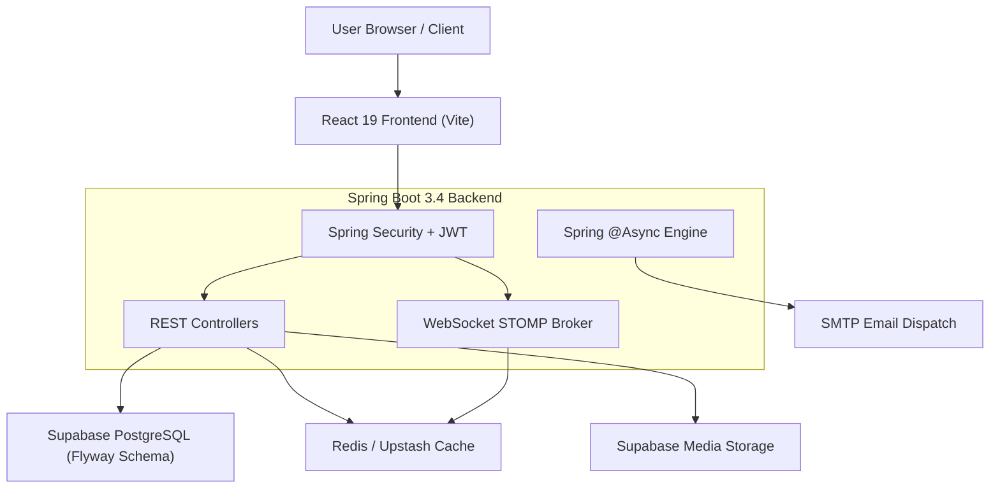

# FriendsHub

<div align="center">

  <h1>FriendsHub 🚀</h1>
  <p><strong>A Modern, Full-Stack Social Media Platform built with Spring Boot 3.4, React 19, PostgreSQL, Redis, and Supabase.</strong></p>

  <p>
    <a href="https://www.friendshub.me">🌐 <strong>Live Website</strong></a>
    &nbsp;•&nbsp;
    <a href="https://github.com/Jayanand07/Friends-Hub">⭐ <strong>GitHub Repository</strong></a>
  </p>

  <p>
    
    
    
    
    
    
    
  </p>

</div>

---

## 📖 Overview

**FriendsHub** is a high-performance, feature-rich social media web application. Core authentication, profiles, social graphs, posts, and relational data are powered by a robust **Spring Boot 3.4** backend with **PostgreSQL** & **Flyway database migrations**. High-concurrency messaging, notifications, and media management leverage **Spring STOMP WebSockets**, **Redis**, and **Supabase Storage**, with a responsive **React 19** user interface.

---

## ✨ Features & Highlights

- 🔐 **Authentication & Security**: JWT Authentication with 15-minute Access Tokens, 7-day Rotating Refresh Tokens, Google OAuth 2.0, BCrypt password hashing, and mandatory Email Verification.
- 🛡️ **Hardened API**: OWASP HTML XSS sanitization across all posts/comments, SHA-256 Redis token blacklisting, sliding-window rate limiting, and exact ECDH P-256 cryptographic key validation.
- 💬 **Real-time Messaging**: Instant 1-on-1 and Group Chat via WebSockets (STOMP) with end-to-end encryption (E2EE) key exchange support.
- 📱 **Social Feed & Stories**: Dynamic feed, image posts, comments, likes, emoji reactions, temporary stories (24-hour TTL with automated hourly purge), and follow/block relationship controls.
- ⚡ **Asynchronous Pipelines**: Non-blocking email dispatches and notification events offloaded via Spring `@Async` thread pool task execution.
- 📊 **Monitoring & Observability**: Integrated Spring Boot Actuator health probes and Prometheus metrics endpoints.
- 🗄️ **Database Integrity**: Automated Flyway SQL schema migrations and Row-Level Security (RLS) policies.

---

## 🏗️ Architecture



---

## 🛠️ Tech Stack

| Domain | Technologies |
| :--- | :--- |
| **Frontend** | React 19, Vite, Tailwind CSS 4, React Router, Framer Motion, Lucide Icons, DOMPurify |
| **Backend** | Java 17, Spring Boot 3.4.2, Spring Security, Spring Data JPA, Spring WebSocket |
| **Database & Migrations** | PostgreSQL on Supabase, Flyway Migrations |
| **Caching & Presence** | Redis / Upstash Redis |
| **Asynchronous Engine** | Spring `@Async` Task Executor |
| **Media Storage** | Supabase Storage |
| **Security Tools** | JJWT 0.12.6, OWASP Java HTML Sanitizer, Apache Commons Text |
| **Build & CI/CD** | Maven, GitHub Actions CI Pipeline, Docker |

---

## 📁 Repository Structure

```text
Friends-Hub/
├── .github/workflows/          # GitHub Actions CI Pipeline (Build, Test, Lint)
├── src/main/java/com/example/socialmedia/
│   ├── config/                 # Security, Async, Redis, WebSocket, WebMVC
│   ├── controller/             # REST API Controllers (Auth, Post, Chat, Admin, User)
│   ├── dto/                    # Type-safe Request/Response DTOs
│   ├── entity/                 # JPA Entities (User, Post, Comment, RefreshToken, etc.)
│   ├── repository/             # Spring Data JPA Repositories
│   ├── security/               # JWT Service & Authentication Filters
│   ├── service/                # Core Business Logic Services
│   └── util/                   # HTML Sanitizer & Crypto Utilities
├── src/main/resources/
│   ├── application.properties  # Application Configuration & Secrets
│   └── db/migration/           # Flyway SQL Migration Scripts (V1..V4)
├── frontend/
│   ├── src/api/                # Axios Interceptors & Endpoint Handlers
│   ├── src/components/         # UI Components (Feed, Chat, Modals)
│   ├── src/context/            # React AuthContext Provider
│   └── src/pages/              # Page Views (Home, Login, Profile, Settings)
├── Dockerfile                  # Production Multi-stage Docker Container
├── docker-compose.yml          # Local Infrastructure (Redis)
└── pom.xml                     # Maven Dependencies & Configuration
```

---

## 📡 Core API Surface

| Domain | Key Endpoints | Description |
| :--- | :--- | :--- |
| **Auth** | `POST /api/auth/register`<br>`POST /api/auth/login`<br>`POST /api/auth/refresh`<br>`POST /api/auth/oauth/google` | Account registration, token rotation, and OAuth authentication |
| **Posts** | `GET /api/posts`<br>`POST /api/posts`<br>`POST /api/posts/upload-image`<br>`POST /api/posts/{id}/like` | Paginated post feed, media upload, and interaction |
| **Users** | `GET /api/users/profile`<br>`PUT /api/users/profile`<br>`POST /api/users/{id}/follow`<br>`GET /api/users/suggestions` | Profile management, social graph, and follow requests |
| **Chat** | `GET /api/chat/history/{userId}`<br>`GET /api/chat/conversations`<br>`WS /ws` | 1-on-1 direct messaging, conversation histories, STOMP sockets |
| **Groups** | `POST /api/chat/groups`<br>`GET /api/chat/groups/{id}/messages`<br>`POST /api/chat/groups/{id}/members/add` | Group creation, membership management, and encrypted group messaging |
| **Stories**| `POST /api/stories`<br>`GET /api/stories`<br>`GET /api/stories/{id}/viewers` | 24-hour expiring media stories and viewer analytics |
| **Admin** | `GET /api/admin/users`<br>`DELETE /api/admin/posts/{id}`<br>`DELETE /api/admin/users/{id}` | Admin moderation dashboard and cascading deletion controls |
| **Health** | `GET /actuator/health`<br>`GET /actuator/prometheus` | Spring Actuator health probes and metrics |

---

## 💻 Local Development Setup

### Prerequisites

- **Java 17+** & **Maven**
- **Node.js 20+** & **npm**
- **Docker Desktop**
- **Supabase Project** (PostgreSQL & Storage Bucket)

### 1. Clone the Repository

```bash
git clone https://github.com/Jayanand07/Friends-Hub.git
cd Friends-Hub
```

### 2. Set Up Environment Variables

Copy the example environment files:

```bash
cp .env.example .env
cp frontend/.env.example frontend/.env
```

Configure your `.env` variables with your local database credentials, JWT secret, and Supabase keys.

### 3. Start Local Infrastructure

```bash
docker compose up -d
```

### 4. Run the Backend

```bash
mvn spring-boot:run
```
- Backend API: `http://localhost:8080/api`
- Health Probe: `http://localhost:8080/actuator/health`

### 5. Run the Frontend

```bash
cd frontend
npm install
npm run dev
```
- Frontend Application: `http://localhost:5173`

---

## 🔒 Security Practices

- **Token Security**: Short-lived (15 min) JWT access tokens combined with 7-day rotating refresh tokens.
- **XSS Defense**: OWASP Java HTML Sanitizer strips untrusted HTML from all posts, comments, and notifications.
- **Input Validation**: Hardened DTOs with `@Valid`, `@Pattern` URL checks, and 12+ character password constraints.
- **Database Safety**: Supabase Row-Level Security (RLS) enabled on all public schema tables with Flyway automated migrations.
- **Memory Protection**: SHA-256 token hashing in Redis prevents JWT memory bloat.

---

## 🤝 Contributing

Contributions are welcome! Please feel free to open an issue or submit a pull request. Refer to [CONTRIBUTING.md](CONTRIBUTING.md) for full guidelines.

---

## 📄 License

Distributed under the MIT License. See [LICENSE.md](LICENSE.md) for details.

---

<div align="center">
  <p>Built with ❤️ by <a href="https://github.com/Jayanand07">Jay Anand</a></p>
</div>
