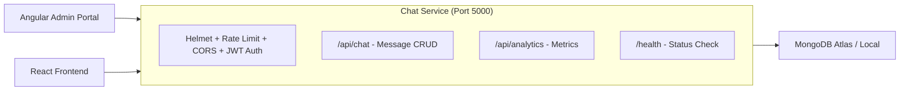

# FriendsHub — Chat Service (Node.js Microservice)

> Node.js · Express.js · MongoDB (Mongoose) · JWT Auth

---

## Overview

The Chat Service is a secondary microservice built with Node.js and Express that provides:
1. **High-concurrency message storage** via MongoDB
2. **Activity logging** for analytics
3. **Analytics API** consumed by the Angular Admin Portal

This service runs independently from the Spring Boot backend and shares the same JWT secret for authentication interoperability.

---

## Architecture



---

## Directory Structure

```
chat-service/
├── server.js                # Express app entry point + middleware setup
├── package.json             # Dependencies and scripts
├── config/
│   └── db.js                # MongoDB connection manager
├── models/
│   ├── ChatMessage.js       # Message schema
│   └── ActivityLog.js       # Activity event schema
└── routes/
    ├── chat.routes.js       # Chat message CRUD endpoints
    └── analytics.routes.js  # Analytics overview endpoint
```

---

## Dependencies

| Package | Version | Purpose |
|:---|:---|:---|
| `express` | 4.19.2 | Web framework |
| `mongoose` | 8.3.1 | MongoDB ODM |
| `jsonwebtoken` | 9.0.2 | JWT signature verification |
| `helmet` | 7.1.0 | Secure HTTP headers |
| `express-rate-limit` | 7.3.1 | Rate limiting |
| `cors` | 2.8.5 | Cross-origin resource sharing |
| `dotenv` | 16.4.5 | Environment variable loading |
| `nodemon` | 3.1.0 (dev) | Auto-restart on file changes |

---

## Server Configuration (`server.js`)

### Middleware Stack (applied in order)
1. **Helmet** — Sets secure HTTP headers (X-Content-Type-Options, HSTS, CSP, etc.)
2. **Global Rate Limiter** — Max 200 requests/minute per IP
3. **Auth Rate Limiter** — Max 20 requests/minute for auth-sensitive endpoints
4. **CORS** — Restricts to `FRONTEND_URL` origins only (no wildcard)
5. **JSON Body Parser** — 16KB limit to prevent payload attacks
6. **JWT Auth Middleware** — Applied to all `/api/*` routes

### JWT Authentication
The service uses the **same JWT secret** as the Spring Boot backend. The middleware:
1. Extracts `Authorization: Bearer <token>` header
2. Verifies JWT signature using HS256 algorithm
3. Extracts `sub` (email), `userId`, and `role` from token claims
4. Attaches decoded user to `req.user`
5. Returns `401` for invalid or expired tokens

### Environment Variables

| Variable | Default | Description |
|:---|:---|:---|
| `JWT_SECRET` | **Required** | JWT signing secret (same as backend) |
| `MONGODB_URI` | `mongodb://localhost:27017/friendshub_chat` | MongoDB connection string |
| `FRONTEND_URL` | `http://localhost:5173` | Allowed CORS origins (comma-separated) |
| `CHAT_SERVICE_PORT` | `5000` | Server port |

---

## MongoDB Schemas

### ChatMessage

```javascript
{
  senderId:   { type: String, required: true, index: true },
  senderName: { type: String, default: 'Anonymous' },
  receiverId: { type: String, required: true, index: true },
  message:    { type: String, required: true, trim: true },
  readStatus: { type: Boolean, default: false },
  mediaUrl:   { type: String, default: null },
  createdAt:  { type: Date, auto },
  updatedAt:  { type: Date, auto }
}
```

### ActivityLog

```javascript
{
  eventType:   { type: String, required: true, enum: ['USER_LOGIN', 'USER_SIGNUP', 'POST_CREATED', 'MESSAGE_SENT', 'ADMIN_ACTION'], index: true },
  description: { type: String, required: true },
  userId:      { type: String, default: 'SYSTEM' },
  username:    { type: String, default: 'System User' },
  ipAddress:   { type: String, default: '127.0.0.1' },
  createdAt:   { type: Date, auto },
  updatedAt:   { type: Date, auto }
}
```

---

## API Endpoints

### Chat Routes (`/api/chat`)

#### GET `/api/chat/messages/:user1/:user2` 🔒
Fetch chat history between two users.

**Security**: Verifies the authenticated user is either `user1` or `user2` — prevents reading other people's conversations.

**Query**: MongoDB `$or` on sender/receiver pairs, sorted by `createdAt` ascending, limited to 100 messages.

**Fallback**: If MongoDB is unavailable, returns demo in-memory messages.

**Response**:
```json
{
  "success": true,
  "count": 5,
  "source": "MongoDB",
  "data": [
    {
      "_id": "...",
      "senderId": "1",
      "senderName": "Alex",
      "receiverId": "2",
      "message": "Hello!",
      "readStatus": false,
      "createdAt": "2026-01-01T00:00:00.000Z"
    }
  ]
}
```

---

#### POST `/api/chat/messages` 🔒
Send a new chat message.

**Security**: `senderId` and `senderName` are **always overridden** from the authenticated JWT — client-supplied values are ignored.

| Field | Source | Description |
|:---|:---|:---|
| `senderId` | JWT (`req.user.userId`) | Sender identity (server-enforced) |
| `senderName` | JWT (`req.user.email`) | Sender display name |
| `receiverId` | Request body | Target user |
| `message` | Request body | Message content |

**Side effect**: Creates an `ActivityLog` entry asynchronously (fire-and-forget).

**Fallback**: On MongoDB error, stores message in-memory array.

---

### Analytics Routes (`/api/analytics`)

#### GET `/api/analytics/overview` 🔒
Returns real-time platform metrics for the admin dashboard.

**Response**:
```json
{
  "status": "ONLINE",
  "service": "FriendsHub Polyglot Node.js + Express + MongoDB Service",
  "timestamp": "2026-01-01T00:00:00.000Z",
  "metrics": {
    "totalMongoMessages": 42,
    "totalActiveUsers": 18,
    "systemLatencyMs": 14,
    "activeServices": [
      "Spring Boot (Java 17)",
      "Express (Node.js)",
      "Angular Dashboard",
      "MongoDB Atlas",
      "Supabase Postgres"
    ]
  },
  "recentLogs": [
    {
      "_id": "...",
      "eventType": "USER_LOGIN",
      "description": "Admin logged into Angular Portal",
      "username": "System Admin",
      "createdAt": "2026-01-01T00:00:00.000Z"
    }
  ]
}
```

**Fallback**: Returns demo data if MongoDB is not yet connected.

---

### Health Endpoint

#### GET `/health` (Public — no auth required)

```json
{
  "status": "UP",
  "service": "FriendsHub Node.js + MongoDB Microservice",
  "database": "MongoDB Atlas / Local",
  "port": 5000
}
```

---

## MongoDB Connection (`config/db.js`)

- Connects to `MONGODB_URI` or falls back to `mongodb://localhost:27017/friendshub_chat`
- Logs connection host (masks credentials from connection string)
- Graceful fallback: prints warning and continues if MongoDB is unreachable

---

## Admin Portal Integration

The Angular admin portal (`admin-portal/`) consumes the Chat Service's analytics API:

```
Angular AppComponent → AnalyticsService → GET /api/analytics/overview
```

**Angular Service** (`analytics.service.ts`):
- Makes HTTP GET to `http://localhost:5000/api/analytics/overview`
- Includes JWT auth header
- Falls back to hardcoded demo data on error

**Angular Component** (`app.component.ts`):
- Displays MongoDB message count, active users, system latency
- Lists active polyglot services
- Shows MongoDB activity log stream in a table
- Refresh button to reload data

---

## Running the Chat Service

### Development
```bash
cd chat-service
npm install
npm run dev     # Uses nodemon for auto-restart
```

### Production
```bash
cd chat-service
npm install --production
npm start       # node server.js
```

### With MongoDB Atlas
1. Create a free cluster at [mongodb.com/atlas](https://www.mongodb.com/atlas)
2. Create a database user with read/write access
3. Whitelist your IP (or use `0.0.0.0/0` for all)
4. Set `MONGODB_URI` to the connection string

### Without MongoDB
The service runs in **demo mode** with in-memory message storage. Chat messages are not persisted.

---

## Security Measures

1. **JWT verification**: Full cryptographic signature verification (HS256), not just decode
2. **Identity enforcement**: `senderId`/`senderName` always from JWT, never from client
3. **Conversation access control**: Users can only read their own conversations
4. **Rate limiting**: 200 req/min global, 20 req/min auth-sensitive
5. **CORS restriction**: Only allowed frontend origin, no wildcards
6. **Helmet headers**: XSS protection, content type sniffing prevention, HSTS
7. **Body size limit**: 16KB max JSON payload
