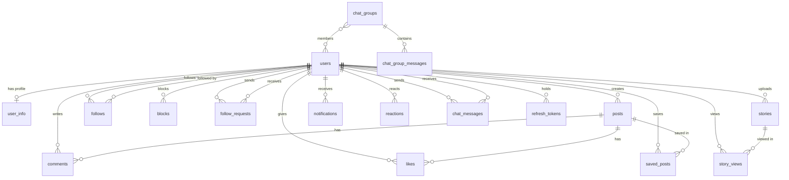

# FriendsHub — Database Schema

> PostgreSQL (Supabase-hosted) · Flyway Migrations · Row-Level Security

---

## Entity Relationship Diagram



---

## Tables

### `users`

Primary user account table.

| Column | Type | Constraints | Description |
|:---|:---|:---|:---|
| `id` | BIGSERIAL | PK, auto-increment | User ID |
| `email` | VARCHAR(255) | UNIQUE, NOT NULL | Login email |
| `password` | VARCHAR(255) | NOT NULL | BCrypt hashed password |
| `username` | VARCHAR(255) | | Display username (added V3) |
| `verification_status` | VARCHAR(20) | NOT NULL, default `PENDING` | `PENDING` or `VERIFIED` |
| `role` | VARCHAR(20) | NOT NULL, default `ROLE_USER` | `ROLE_USER`, `ROLE_ADMIN`, `ROLE_SUPER_ADMIN` |
| `verification_token` | VARCHAR(255) | | Email verification token |
| `token_expiry` | TIMESTAMP | | Verification token expiry |
| `password_reset_token` | VARCHAR(255) | | OTP for password reset |
| `reset_token_expiry` | TIMESTAMP | | Reset token expiry |
| `is_private_account` | BOOLEAN | NOT NULL, default `false` | Private account flag |
| `allow_story_view_by_followers_only` | BOOLEAN | NOT NULL, default `true` | Story visibility setting |
| `profile_visibility` | VARCHAR(20) | NOT NULL, default `PUBLIC` | `PUBLIC` or `PRIVATE` |
| `auth_provider` | VARCHAR(50) | default `LOCAL` | `LOCAL` or `GOOGLE` (added V3) |
| `public_key` | TEXT | | ECDH P-256 public key (base64) for E2EE |
| `created_at` | TIMESTAMP | auto | Account creation time |
| `updated_at` | TIMESTAMP | auto | Last update time |

**Indexes**: `idx_users_email_lower` (LOWER(email)), `idx_users_public_key` (id WHERE public_key IS NOT NULL)

---

### `user_info`

Extended profile information (1:1 with users).

| Column | Type | Constraints | Description |
|:---|:---|:---|:---|
| `id` | BIGSERIAL | PK | Profile info ID |
| `user_id` | BIGINT | FK → users(id), UNIQUE | Owning user |
| `first_name` | VARCHAR(255) | | First name |
| `last_name` | VARCHAR(255) | | Last name |
| `bio` | TEXT | | Profile biography |
| `location` | VARCHAR(255) | | Location string |
| `profile_pic_url` | VARCHAR(2048) | | Profile picture URL |
| `website` | VARCHAR(2048) | | Personal website |
| `social_links` | TEXT | | JSON-serialized social links |

---

### `posts`

User-created posts.

| Column | Type | Constraints | Description |
|:---|:---|:---|:---|
| `id` | BIGSERIAL | PK | Post ID |
| `content` | TEXT | | Post text content (HTML sanitized) |
| `image_url` | VARCHAR(2048) | | Attached image URL |
| `user_id` | BIGINT | FK → users(id), NOT NULL | Post author |
| `created_at` | TIMESTAMP | auto | Creation time |
| `updated_at` | TIMESTAMP | auto | Last edit time |

**Indexes**: `idx_post_user` (user_id), `idx_post_created_at` (created_at), `idx_posts_created_at` (created_at DESC), `idx_posts_user_id` (user_id)

---

### `comments`

Comments on posts.

| Column | Type | Constraints | Description |
|:---|:---|:---|:---|
| `id` | BIGSERIAL | PK | Comment ID |
| `content` | TEXT | NOT NULL | Comment text (sanitized) |
| `user_id` | BIGINT | FK → users(id) | Comment author |
| `post_id` | BIGINT | FK → posts(id) | Parent post |
| `created_at` | TIMESTAMP | auto | Creation time |

**Indexes**: `idx_comments_post` (post_id, created_at ASC)

---

### `likes`

Post like records (toggle semantics).

| Column | Type | Constraints | Description |
|:---|:---|:---|:---|
| `id` | BIGSERIAL | PK | Like ID |
| `user_id` | BIGINT | FK → users(id) | Liking user |
| `post_id` | BIGINT | FK → posts(id) | Liked post |
| `created_at` | TIMESTAMP | auto | Like time |

**Unique constraint**: (user_id, post_id)

---

### `follows`

User follow relationships.

| Column | Type | Constraints | Description |
|:---|:---|:---|:---|
| `id` | BIGSERIAL | PK | Follow ID |
| `follower_id` | BIGINT | FK → users(id) | Following user |
| `following_id` | BIGINT | FK → users(id) | Followed user |
| `created_at` | TIMESTAMP | auto | Follow date |

**Indexes**: `idx_follows_follower_id`, `idx_follows_following_id`, `idx_follows_pair` (follower_id, following_id)

---

### `follow_requests`

Pending follow requests for private accounts.

| Column | Type | Constraints | Description |
|:---|:---|:---|:---|
| `id` | BIGSERIAL | PK | Request ID |
| `requester_id` | BIGINT | FK → users(id) | Requesting user |
| `receiver_id` | BIGINT | FK → users(id) | Target user |
| `status` | VARCHAR(20) | | `PENDING`, `ACCEPTED`, `REJECTED` |
| `created_at` | TIMESTAMP | auto | Request time |

---

### `blocks`

User block relationships.

| Column | Type | Constraints | Description |
|:---|:---|:---|:---|
| `id` | BIGSERIAL | PK | Block ID |
| `blocker_id` | BIGINT | FK → users(id) | Blocking user |
| `blocked_id` | BIGINT | FK → users(id) | Blocked user |
| `created_at` | TIMESTAMP | auto | Block time |

---

### `stories`

24-hour expiring media stories.

| Column | Type | Constraints | Description |
|:---|:---|:---|:---|
| `id` | BIGSERIAL | PK | Story ID |
| `user_id` | BIGINT | FK → users(id) | Story author |
| `image_url` | VARCHAR(2048) | NOT NULL | Story image URL |
| `expires_at` | TIMESTAMP | NOT NULL | Expiry time (24h from creation) |
| `created_at` | TIMESTAMP | auto | Upload time |

**Indexes**: `idx_stories_active` (user_id, expires_at DESC)

---

### `story_views`

Story view tracking.

| Column | Type | Constraints | Description |
|:---|:---|:---|:---|
| `id` | BIGSERIAL | PK | View ID |
| `story_id` | BIGINT | FK → stories(id) | Viewed story |
| `viewer_id` | BIGINT | FK → users(id) | Viewing user |
| `viewed_at` | TIMESTAMP | auto | View time |

---

### `chat_messages`

1-on-1 direct messages.

| Column | Type | Constraints | Description |
|:---|:---|:---|:---|
| `id` | BIGSERIAL | PK | Message ID |
| `sender_id` | BIGINT | FK → users(id) | Sender |
| `receiver_id` | BIGINT | FK → users(id) | Receiver |
| `content` | TEXT | | Message content (encrypted) |
| `image_url` | VARCHAR(2048) | | Attached image URL |
| `iv` | VARCHAR(500) | | AES-GCM initialization vector |
| `timestamp` | TIMESTAMP | auto | Send time |
| `is_read` | BOOLEAN | default `false` | Read status |
| `is_deleted` | BOOLEAN | default `false` | Soft delete flag |

**Indexes**: `idx_chat_messages_sender_receiver`, `idx_chat_messages_receiver_sender`, `idx_chat_messages_dm`

---

### `chat_groups`

Group chat metadata.

| Column | Type | Constraints | Description |
|:---|:---|:---|:---|
| `id` | BIGSERIAL | PK | Group ID |
| `name` | VARCHAR(100) | NOT NULL | Group name |
| `group_image_url` | VARCHAR(2048) | | Group avatar URL |
| `creator_id` | BIGINT | FK → users(id) | Group creator |
| `group_keys` | TEXT | | Encrypted group key material |
| `created_at` | TIMESTAMP | auto | Creation time |

---

### `chat_group_members`

Group membership (join table).

| Column | Type | Constraints | Description |
|:---|:---|:---|:---|
| `group_id` | BIGINT | FK → chat_groups(id) | Group |
| `user_id` | BIGINT | FK → users(id) | Member |

**Indexes**: `idx_chat_group_members_user_id`, `idx_chat_group_members_group_id`

---

### `chat_group_messages`

Messages within groups.

| Column | Type | Constraints | Description |
|:---|:---|:---|:---|
| `id` | BIGSERIAL | PK | Message ID |
| `group_id` | BIGINT | FK → chat_groups(id) | Target group |
| `sender_id` | BIGINT | FK → users(id) | Message sender |
| `content` | TEXT | | Encrypted message content |
| `image_url` | VARCHAR(2048) | | Attached image |
| `iv` | VARCHAR(500) | | AES-GCM IV |
| `created_at` | TIMESTAMP | auto | Send time |

**Indexes**: `idx_chat_group_messages_group_created`, `idx_group_messages_group`

---

### `reactions`

Emoji/GIF reactions on posts, comments, and stories.

| Column | Type | Constraints | Description |
|:---|:---|:---|:---|
| `id` | BIGSERIAL | PK | Reaction ID |
| `user_id` | BIGINT | FK → users(id) | Reacting user |
| `target_type` | VARCHAR(20) | NOT NULL | `POST`, `COMMENT`, `STORY` |
| `target_id` | BIGINT | NOT NULL | ID of target entity |
| `emoji` | VARCHAR(50) | | Emoji character |
| `gif_url` | VARCHAR(2048) | | GIF URL |

**Indexes**: `idx_reactions_target` (target_id, target_type)

---

### `saved_posts`

Bookmarked/saved posts.

| Column | Type | Constraints | Description |
|:---|:---|:---|:---|
| `id` | BIGSERIAL | PK | Save ID |
| `user_id` | BIGINT | FK → users(id) | Saving user |
| `post_id` | BIGINT | FK → posts(id) | Saved post |
| `saved_at` | TIMESTAMP | auto | Save time |

---

### `notifications`

In-app notifications.

| Column | Type | Constraints | Description |
|:---|:---|:---|:---|
| `id` | BIGSERIAL | PK | Notification ID |
| `user_id` | BIGINT | FK → users(id) | Recipient |
| `type` | VARCHAR(50) | | Notification type (FOLLOW, LIKE, COMMENT, etc.) |
| `message` | TEXT | | Notification text |
| `reference_id` | BIGINT | | Related entity ID |
| `is_read` | BOOLEAN | default `false` | Read status |
| `created_at` | TIMESTAMP | auto | Creation time |

**Indexes**: `idx_notifications_user_read` (user_id, is_read, created_at DESC)

---

### `refresh_tokens`

JWT refresh token storage.

| Column | Type | Constraints | Description |
|:---|:---|:---|:---|
| `id` | BIGSERIAL | PK | Token ID |
| `user_id` | BIGINT | FK → users(id) | Token owner |
| `token` | VARCHAR(255) | UNIQUE | Refresh token value |
| `expiry_date` | TIMESTAMP | | Token expiry |

---

### `api_usage_log`

API usage metrics.

| Column | Type | Description |
|:---|:---|:---|
| `id` | BIGSERIAL | Log ID |
| `endpoint` | VARCHAR(255) | API endpoint path |
| `method` | VARCHAR(10) | HTTP method |
| `status` | INT | Response status code |
| `duration_ms` | BIGINT | Request duration in ms |
| `user_email` | VARCHAR(255) | Requesting user |
| `ip_address` | VARCHAR(50) | Client IP |
| `created_at` | TIMESTAMP | Request time |

---

### `admin_action_logs`

Admin moderation audit trail.

| Column | Type | Description |
|:---|:---|:---|
| `id` | BIGSERIAL | Log ID |
| `action` | VARCHAR(255) | Action description |
| `target_id` | BIGINT | Target entity ID |
| `performed_by` | VARCHAR(255) | Admin email |
| `timestamp` | TIMESTAMP | Action time |

---

## Row-Level Security (RLS)

RLS is **enabled** on all 18 public-facing tables:

| Table | RLS Enabled In |
|:---|:---|
| `users`, `posts`, `stories`, `story_views`, `comments`, `likes`, `follows`, `notifications`, `chat_messages`, `chat_groups`, `chat_group_members`, `chat_group_messages`, `blocks`, `user_info` | V1 |
| `saved_posts`, `refresh_tokens` | V1 + V4 |

> **Note**: RLS policies are configured in Supabase Dashboard. The Flyway migrations enable RLS at the table level; the actual policies (e.g., "users can only read their own messages") are managed through Supabase's UI.

---

## Flyway Migration History

| Version | Filename | Description |
|:---|:---|:---|
| V1 | `V1__initial_schema.sql` | Performance indexes on chat_messages, follows, users; RLS enablement on 16 tables |
| V2 | `V2__add_performance_indexes.sql` | Indexes on posts, notifications, stories, comments, reactions, follows |
| V3 | `V3__add_oauth_fields.sql` | Add `username` and `auth_provider` columns to users |
| V4 | `V4__enable_rls_all_tables.sql` | Enable RLS on `saved_posts` and `refresh_tokens` |

### Configuration
```properties
spring.jpa.hibernate.ddl-auto=none          # Flyway manages all schema changes
spring.flyway.enabled=true
spring.flyway.baseline-on-migrate=true
spring.flyway.baseline-version=1
spring.flyway.repair-on-migrate=true
```

> **Important**: JPA `ddl-auto` is `none`. Never change it to `update` or `create-drop`. All schema changes must be done via new Flyway migration files.
