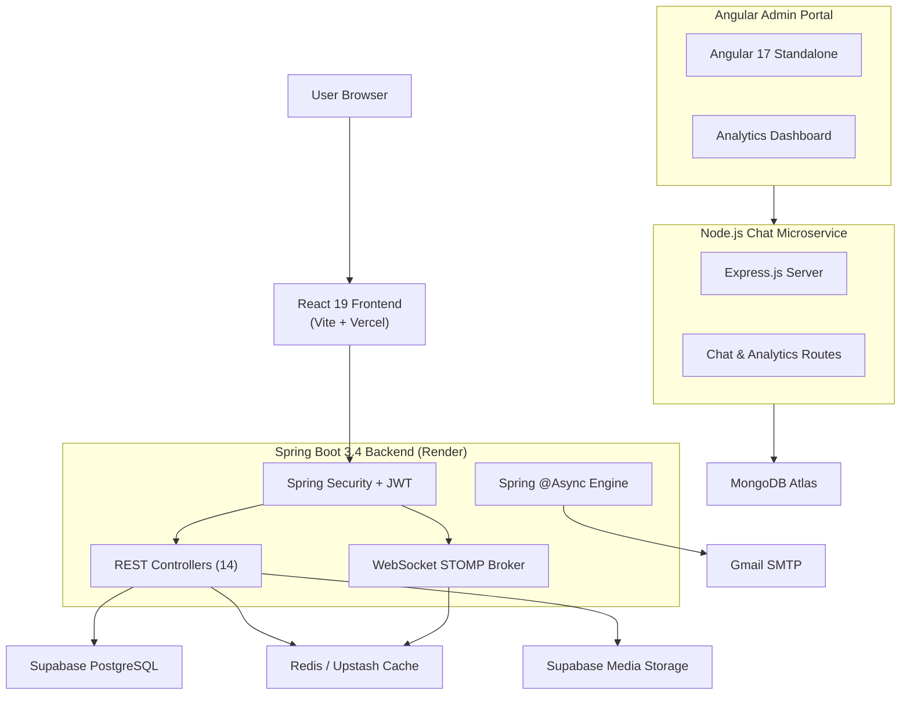

# FriendsHub — Project Overview

<div align="center">
  <h2>🚀 FriendsHub</h2>
  <p><strong>A Modern, Full-Stack Social Media Platform</strong></p>
  <p>Built with Spring Boot 3.4 · React 19 · PostgreSQL · Redis · Supabase · MongoDB</p>
</div>

---

## What is FriendsHub?

FriendsHub is a production-grade, feature-rich social media web application. It supports user profiles, posts, stories, comments, reactions, real-time chat (1-on-1 and group), follow/block relationships, friend recommendations, activity feeds, notifications, and a full admin moderation dashboard — all secured with JWT authentication, Google OAuth 2.0, end-to-end encryption, and OWASP-compliant XSS sanitization.

**Live Website**: [https://www.friendshub.me](https://www.friendshub.me)  
**GitHub Repository**: [https://github.com/Jayanand07/Friends-Hub](https://github.com/Jayanand07/Friends-Hub)

---

## Architecture Overview

FriendsHub is a **polyglot microservices** application consisting of three independent services and a frontend SPA:



---

## Tech Stack

| Layer | Technology | Purpose |
|:---|:---|:---|
| **Frontend** | React 19, Vite, Tailwind CSS 4, React Router 7, Framer Motion, Lucide Icons | User-facing SPA |
| **Backend** | Java 17, Spring Boot 3.4.2, Spring Security, Spring Data JPA, Spring WebSocket | Core API server |
| **Database** | PostgreSQL (Supabase-hosted), Flyway Migrations | Relational data store |
| **Cache** | Redis / Upstash Redis | Token blacklists, caching, online presence |
| **Realtime** | STOMP over WebSocket | Chat, typing indicators, read receipts |
| **Media** | Supabase Storage | Image uploads (posts, stories, profile pics) |
| **Email** | Gmail SMTP via Spring Mail | Verification, password reset, notifications |
| **Chat Service** | Node.js, Express, MongoDB (Mongoose) | High-concurrency message storage |
| **Admin Portal** | Angular 17 (Standalone) | Analytics dashboard |
| **Auth** | JWT (JJWT 0.12.6), Google OAuth 2.0, BCrypt | Authentication & authorization |
| **Security** | OWASP HTML Sanitizer, Resilience4j, Rate Limiting | XSS defense, circuit breaking |
| **CI/CD** | GitHub Actions, Docker | Automated build & test |
| **Hosting** | Render (backend), Vercel (frontend) | Production deployment |

---

## Feature Highlights

### 🔐 Authentication & Security
- JWT with 15-minute access tokens + 7-day rotating refresh tokens
- Google OAuth 2.0 login
- Email verification with expiring tokens
- Password reset via OTP
- SHA-256 token blacklisting in Redis
- OWASP HTML sanitization on all user input
- Sliding-window rate limiting (global + per-user)
- ECDH P-256 public key validation for E2EE

### 💬 Real-time Messaging
- 1-on-1 direct chat via STOMP WebSocket
- Group chat with member management
- End-to-end encryption (ECDH key exchange + AES-256-GCM)
- Typing indicators and read receipts
- Online presence tracking
- Message deletion

### 📱 Social Feed & Interactions
- Paginated post feed with images
- Comments with nested threading
- Like/unlike toggle
- Emoji reactions and GIF reactions
- Saved/bookmarked posts
- 24-hour expiring stories with viewer analytics

### 👥 Social Graph
- Follow/unfollow with private account support
- Follow requests (accept/reject) for private accounts
- Block/unblock users
- Mutual friends detection
- Friend suggestions & recommendations
- Network graph visualization
- Friend compatibility scores
- Friendship milestones tracking
- Friend request analytics

### 🔔 Notifications & Activity
- Real-time notification bell with unread count
- Activity feed page
- Mark-as-read (individual and bulk)

### ⚙️ User Settings
- Profile editing (name, bio, location, links, profile picture)
- Privacy toggle (public/private account)
- Story visibility settings
- Profile completeness bar
- Theme switching (dark/light)

### 🛡️ Admin Panel
- Angular-based admin dashboard
- View all users (paginated)
- Delete users, posts, comments
- Block/unblock users
- Admin action audit logs
- Real-time analytics from MongoDB

### 📊 Monitoring & Observability
- Spring Actuator health probes
- Prometheus metrics endpoint
- API usage metrics interceptor
- Circuit breaker (Resilience4j) for chat and notifications

---

## Repository Structure

```
Friends-Hub/
├── .github/workflows/ci.yml      # GitHub Actions CI pipeline
├── .gitignore                     # Git ignore rules
├── .env.example                   # Backend env template
├── Dockerfile                     # Multi-stage Docker build
├── docker-compose.yml             # Local Redis for development
├── pom.xml                        # Maven dependencies
├── LICENSE.md                     # MIT License
├── CODE_OF_CONDUCT.md             # Community guidelines
├── CONTRIBUTING.md                # Contribution guidelines
│
├── src/main/java/com/example/socialmedia/
│   ├── SocialMediaApplication.java
│   ├── config/                    # Security, Redis, WebSocket, Mail, Async configs
│   ├── controller/                # 14 REST API controllers
│   ├── dto/                       # 33 request/response DTOs
│   ├── entity/                    # 25 JPA entities + enums
│   ├── exception/                 # Global exception handler
│   ├── repository/                # 19 Spring Data JPA repositories
│   ├── security/                  # JWT service, auth filter, STOMP interceptor
│   ├── service/                   # 20 business logic services
│   ├── scheduler/                 # Story cleanup + keep-alive schedulers
│   └── util/                      # HTML sanitizer utility
│
├── src/main/resources/
│   ├── application.properties     # Spring configuration (env-driven)
│   └── db/migration/              # 4 Flyway SQL migrations (V1–V4)
│
├── frontend/                      # React 19 SPA (Vite)
│   ├── src/api/                   # 9 Axios API modules
│   ├── src/components/            # 30+ UI components + chat + ui subfolders
│   ├── src/context/               # Auth & Theme contexts
│   ├── src/crypto/                # E2EE (ECDH + AES-GCM)
│   ├── src/layouts/               # MainLayout with responsive sidebar
│   ├── src/lib/                   # Supabase client
│   ├── src/pages/                 # 13 page components
│   ├── src/socket/                # STOMP WebSocket client
│   └── src/utils/                 # Image, sanitize, timeAgo utilities
│
├── chat-service/                  # Node.js + Express + MongoDB microservice
│   ├── config/db.js               # MongoDB connection
│   ├── models/                    # Mongoose schemas (ChatMessage, ActivityLog)
│   ├── routes/                    # Chat & analytics REST routes
│   └── server.js                  # Express app entry point
│
├── admin-portal/                  # Angular 17 admin dashboard
│   ├── src/app/                   # Standalone component + analytics service
│   └── src/styles.css             # Global dashboard styles
│
└── docs/                          # 📚 Comprehensive project documentation
    ├── PROJECT_OVERVIEW.md         # This file
    ├── BACKEND_ARCHITECTURE.md     # Spring Boot backend deep-dive
    ├── FRONTEND_ARCHITECTURE.md    # React frontend deep-dive
    ├── API_REFERENCE.md            # Complete REST API reference
    ├── DATABASE_SCHEMA.md          # Entity relationships & schema
    ├── DEPLOYMENT_GUIDE.md         # Production deployment instructions
    └── CHAT_SERVICE.md             # Node.js chat microservice docs
```

---

## Quick Start

```bash
# 1. Clone
git clone https://github.com/Jayanand07/Friends-Hub.git
cd Friends-Hub

# 2. Environment
cp .env.example .env
cp frontend/.env.example frontend/.env
# Edit both files with your credentials

# 3. Start Redis
docker compose up -d

# 4. Run Backend
mvn spring-boot:run

# 5. Run Frontend
cd frontend
npm install
npm run dev
```

- **Backend API**: http://localhost:8080/api
- **Frontend**: http://localhost:5173
- **Health Check**: http://localhost:8080/actuator/health

---

## License

MIT License — see [LICENSE.md](../LICENSE.md)

Built with ❤️ by [Jay Anand](https://github.com/Jayanand07)
